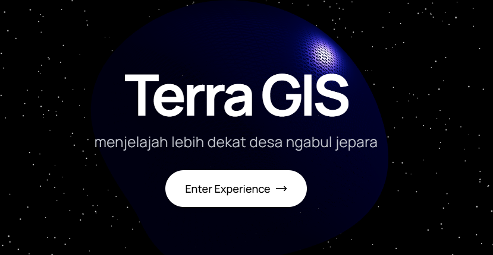

<div align="center">

# 🌍 Terra GIS
### Menjelajah Lebih Dekat Desa Ngabul Jepara



[](https://nextjs.org/)
[](https://supabase.io/)
[](https://tailwindcss.com/)
[](https://leafletjs.com/)
[](LICENSE)

---

### 🌟 About The Project

**Terra GIS** adalah platform Sistem Informasi Geografis (SIG) modern yang dirancang untuk memvisualisasikan dan memetakan potensi serta infrastruktur di **Desa Ngabul, Jepara**. 

Dibangun dengan teknologi web terkini, aplikasi ini menghadirkan pengalaman eksplorasi spasial yang interaktif, cepat, dan memukau secara visual.

</div>

---

## ✨ Key Features

*   **🗺️ Interactive 3D/2D Maps**: Jelajahi peta dengan kontrol intuitif dan transisi yang mulus.
*   **📍 Location Tracking**: Pinpoint lokasi penting dengan koordinat presisi.
*   **📊 Real-time Data**: Terintegrasi langsung dengan Supabase untuk data yang selalu *up-to-date*.
*   **🎨 Stunning UI**: Antarmuka modern dengan sentuhan *glassmorphism* dan animasi halus.
*   **📱 Responsive Design**: Akses dari perangkat apapun, desktop maupun mobile.

---

## 🚀 Tech Stack

Project ini dibangun dengan cinta menggunakan:

*   **Framework**: [Next.js](https://nextjs.org/) (React)
*   **Database**: [Supabase](https://supabase.com/) (PostgreSQL + PostGIS)
*   **Styling**: [Tailwind CSS](https://tailwindcss.com/)
*   **Maps**: [React Leaflet](https://react-leaflet.js.org/) & [MapTiler](https://www.maptiler.com/)
*   **Animation**: [Framer Motion](https://www.framer.com/motion/)
*   **3D Experience**: [Three.js](https://threejs.org/) (@react-three/fiber)

---

## 🛠️ Getting Started

Ikuti langkah ini untuk menjalankan project di lokal komputer Anda.

### Prerequisites

*   Node.js (v18+)
*   NPM / Yarn / PNMP

### Installation

1.  Clone repository
    ```bash
    git clone https://github.com/ypratama123/TerraGIS.git
    cd TerraGIS
    ```

2.  Install dependencies
    ```bash
    npm install
    ```

3.  Setup Environment Variables
    Buat file `.env.local` dan isi dengan konfigurasi Supabase Anda:
    ```env
    NEXT_PUBLIC_SUPABASE_URL=your_supabase_url
    NEXT_PUBLIC_SUPABASE_ANON_KEY=your_supabase_anon_key
    ```

4.  Run Development Server
    ```bash
    npm run dev
    ```

Buka [http://localhost:3000](http://localhost:3000) di browser Anda.

---

## 👨‍💻 Developer

Developed with ❤️ by **Yoga Pratama**

*   📅 **Year**: 2025
*   📍 **Location**: Jepara, Indonesia

---

<div align="center">

*"Mapping the future, one coordinate at a time."*

© 2025 Terra GIS. All Rights Reserved.

</div>
